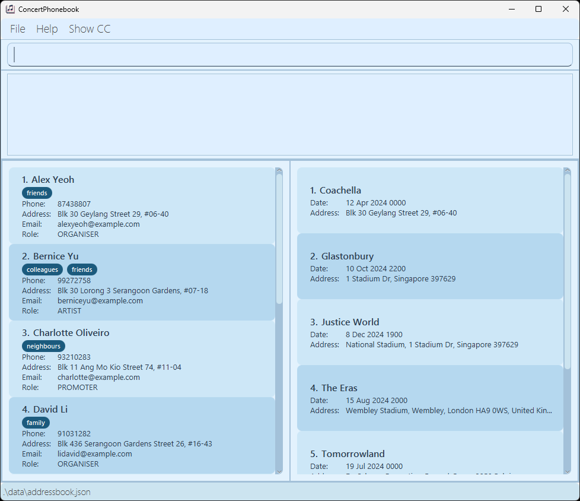

## ConcertAddressBook
ConcertAddressBook is a **desktop app** for **Concert Organisers** to manage your Concert contacts, optimized for use via a Command Line Interface (CLI) with also a Graphical User Interface (GUI) in place to assist with information display. Manage your _contacts_ and _concerts_ in the book, finding contact information faster than your regular GUI contact management applications.

1. [Quick start](#Quick-Start)
2. [Features](#features)
   1. [Adding a Person](#adding-a-person-addp)
   2. [Listing all persons](#listing-all-persons--list)
   3. [Editing a person](#editing-a-person--edit)
   4. [Finding a person](#finding-a-person-findp)
   5. [Deleting person](#deleting-a-person--delete)
   6. [Clearing All Entries](#clearing-all-entries--clear)
   7. [Exiting programme](#exiting-the-program--exit)
3. [FAQ](#faq)
4. [Known Issues](#known-issues)
5. [Command Summary](#command-summary)

--------------------------------------------------------------------------------------------------------------------

## Quick start

1. Ensure you have Java `17` or above installed in your Computer.

1. Download the latest `.jar` file from [here](nil). (COMING SOON)

1. Copy the file to the folder you want to use as the _home folder_ for your ConcertAddressBook.

1. Open a command terminal, `cd` into the folder you put the jar file in, and use the `java -jar tp.jar` command to run the application. 
   A GUI similar to the below should appear in a few seconds. Note how the app contains some sample data. 
   

1. Type the command in the command box and press Enter to execute it. e.g. typing **`help`** and pressing Enter will open the help window. 
   Some example commands you can try:

   * `list` : Lists all contacts.

   * `addp n/John Doe p/98765432 e/johnd@example.com a/311, Clementi Ave 2, #02-25 r/organiser t/friends` : Adds a contact named `John Doe` to the Address Book.

   * `delete 3` : Deletes the 3rd contact shown in the current list.

   * `clear` : Deletes all contacts.
   
   * `addc` : Adds Concert to the ConcertPhoneBook
   
   * `addcc` : Links a person to a concert
   
   * `findp` : Finds person from list of contacts
   
   * `exit` : Exits the app.

1. Refer to the [Features](#features) below for details of each command.

--------------------------------------------------------------------------------------------------------------------

## Features

**:information_source: Notes about the command format:** 

* Words in `UPPER_CASE` are the parameters to be supplied by the user. 
  e.g. in `add n/NAME`, `NAME` is a parameter which can be used as `add n/John Doe`.

* Items in square brackets are optional. 
  e.g `n/NAME [t/TAG]` can be used as `n/John Doe t/friend` or as `n/John Doe`.

* Items with `…`​ after them can be used multiple times including zero times. 
  e.g. `[t/TAG]…​` can be used as ` ` (i.e. 0 times), `t/friend`, `t/friend t/family` etc.

* Parameters can be in any order. 
  e.g. if the command specifies `n/NAME p/PHONE_NUMBER`, `p/PHONE_NUMBER n/NAME` is also acceptable.

* Extraneous parameters for commands that do not take in parameters (such as `help`, `list`, `exit` and `clear`) will be ignored. 
  e.g. if the command specifies `help 123`, it will be interpreted as `help`.

* If you are using a PDF version of this document, be careful when copying and pasting commands that span multiple lines as space characters surrounding line-breaks may be omitted when copied over to the application.

--------------------------------------------------------------------------------------------------------------------

### Viewing help : `help`

Shows a message explaning how to access the help page (User Guide).

Format: `help`

### Adding a person: `addp`

Adds a person to the Concert Address book.

Format: `add n/NAME p/PHONE_NUMBER e/EMAIL a/ADDRESS r/ROLE [t/TAG]…​`

:bulb: **Tip:**
A person can have any number of tags (including 0)

Examples:
* `addp n/John Doe p/98765432 e/johnd@example.com a/John street, block 123, #01-01 r/Organiser`
* `addp n/Betsy Crowe t/friend e/betsycrowe@example.com a/Newgate Prison r/Artist p/1234567 t/criminal`

### Adding a Concert: `addc`

Adds a Concert to the Concert Address book.

Format: `addc n/CONCERTNAME a/ADDRESS d/DATE`

Examples:
* `addc n/Coachella a/81800 51st Ave, Indio, Southern California, United States d/2024-12-20 1010`

### Adding a ConcertContact: `addcc`

Adds an association to the contact in the Concert Address book with another Concert. 

Format: `addcc n/CONCERTNAME a/ADDRESS d/DATE`

### Listing all persons : `list`

Shows a list of all persons in the Concert address book.

Format: `list`

### Editing a person : `edit`

Edits an existing person in the Concert address book.

Format: `edit INDEX [n/NAME] [p/PHONE] [e/EMAIL] [a/ADDRESS] [r/ROLE] [t/TAG]…​`

* Edits the person at the specified `INDEX`. The index refers to the index number shown in the displayed person list. The index **must be a positive integer** 1, 2, 3, …​
* At least one of the optional fields must be provided.
* Existing values will be updated to the input values.
* When editing tags, the existing tags of the person will be removed i.e adding of tags is not cumulative.
* You can remove all the person’s tags by typing `t/` without
    specifying any tags after it.

Examples:
*  `edit 1 p/91234567 e/johndoe@example.com` Edits the phone number and email address of the 1st person to be `91234567` and `johndoe@example.com` respectively.
*  `edit 2 n/Betsy Crower t/` Edits the name of the 2nd person to be `Betsy Crower` and clears all existing tags.

### Finding a person: `findp`

Finds persons whose names contain any of the given keywords.

Format: `findp n/KEYWORD [KEYWORD] r/ROLE`

* The search is case-insensitive. e.g `hans` will match `Hans`
* The order of the keywords does not matter. e.g. `Hans Bo` will match `Bo Hans`
* Only full words will be matched e.g. `Han` will not match `Hans`
* Persons matching both name and role from the command entry will be returned (i.e. `OR` search).
  e.g. `findp n/Hans Bo r/Artist` will return `Hans Gruber, Artist` and `Bo Yang, Artist`

Examples:
* `findp n/Alex Roy r/Artist` returns `Alex Yu and Roy Balakrishnan`  
  

### Deleting a person : `delete`

Deletes the specified person from the Concert address book.

Format: `delete INDEX`

* Deletes the person at the specified `INDEX`.
* The index refers to the index number shown in the displayed person list.
* The index **must be a positive integer** 1, 2, 3, …​

Examples:
* `list` followed by `delete 2` deletes the 2nd person in the Concert address book.
* `find Betsy` followed by `delete 1` deletes the 1st person in the results of the `find` command.

### Clearing all entries : `clear`

Clears all entries from the Concert address book.

Format: `clear`

### Exiting the program : `exit`

Exits the program.

Format: `exit`

### Saving the data

ConcertAddressBook data are saved in the hard disk automatically after any command that changes the data. There is no need to save manually.

### Editing the data file

ConcertAddressBook data are saved automatically as a JSON file `[JAR file location]/data/addressbook.json`. Advanced users are welcome to update data directly by editing that data file.

:exclamation: **Caution:**
If your changes to the data file makes its format invalid, ConcertAddressBook will discard all data and start with an empty data file at the next run. Hence, it is recommended to take a backup of the file before editing it. 
Furthermore, certain edits can cause the AddressBook to behave in unexpected ways (e.g., if a value entered is outside of the acceptable range). Therefore, edit the data file only if you are confident that you can update it correctly.

### Archiving data files `[coming in v2.0]`

--------------------------------------------------------------------------------------------------------------------

## FAQ

**Q**: How do I transfer my data to another Computer? 
**A**: Install the app in the other computer and overwrite the empty data file it creates with the file that contains the data of your previous AddressBook home folder.

--------------------------------------------------------------------------------------------------------------------

## Known issues

1. **When using multiple screens**, if you move the application to a secondary screen, and later switch to using only the primary screen, the GUI will open off-screen. The remedy is to delete the `preferences.json` file created by the application before running the application again.
2. **If you minimize the Help Window** and then run the `help` command (or use the `Help` menu, or the keyboard shortcut `F1`) again, the original Help Window will remain minimized, and no new Help Window will appear. The remedy is to manually restore the minimized Help Window.

--------------------------------------------------------------------------------------------------------------------

## Command summary

Action | Format, Examples
--------|------------------
**Add Person** | `addp n/NAME p/PHONE_NUMBER e/EMAIL a/ADDRESS r/ROLE [t/TAG]…​`   e.g., `add n/Alex Yeoh p/22224444 e/alexyeoh@example.com a/123, Clementi Rd, 1234665 r/Artist t/friend`
**Add Concert** |`addc n/CONCERTNAME a/ADDRESS d/DATE `  e.g. `addc n/Coachella a/81800 51st Ave, Indio, Southern California, United States d/2024-12-20 1010`
**Add ConcertContact** | `addcc `
**Clear** | `clear`
**Delete** | `delete INDEX`  e.g., `delete 3`
**Edit** | `edit INDEX [n/NAME] [p/PHONE_NUMBER] [e/EMAIL] [a/ADDRESS] [t/TAG]…​`  e.g.,`edit 2 n/James Lee e/jameslee@example.com`
**Find** | `find KEYWORD [MORE_KEYWORDS]`  e.g., `find James Jake`
**List** | `list`
**Help** | `help`
